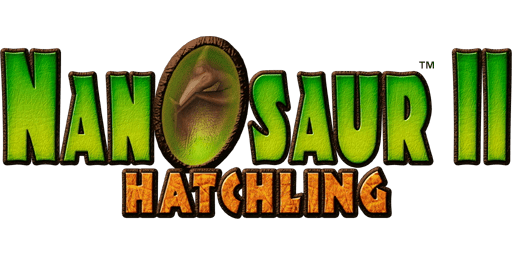
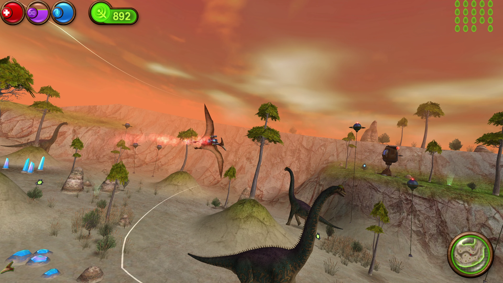

# Nanosaur II: Hatchling

This is a port of Pangea Software’s 2004 game **Nanosaur 2** to modern operating systems.

**Download the game for macOS, Windows and Linux here:** https://github.com/jorio/Nanosaur2/releases

## Documentation

- Original instruction manual:
    [English](docs/Instructions-EN.pdf) -
    [Dutch](docs/Instructions-NL.pdf) -
    [French](docs/Instructions-FR.pdf) -
    [German](docs/Instructions-DE.pdf) -
    [Italian](docs/Instructions-IT.pdf) -
    [Japanese](docs/Instructions-JA.pdf) -
    [Spanish](docs/Instructions-ES.pdf)    
- [BUILD](BUILD.md) - How to build the game from source
- [CHANGELOG](CHANGELOG.md) - Nanosaur 2 version history
- [LICENSE](LICENSE.md) (CC-BY-NC-SA 4.0)

## More Pangea stuff!

Check out my ports of other Pangea classics:
- [Billy Frontier](https://github.com/jorio/BillyFrontier)
- [Bugdom](https://github.com/jorio/Bugdom)
- [Cro-Mag Rally](https://github.com/jorio/CroMagRally)
- [Mighty Mike (Power Pete)](https://github.com/jorio/MightyMike)
- [Nanosaur 1](https://github.com/jorio/Nanosaur)
- [Nanosaur 2](https://github.com/jorio/Nanosaur)
- [Otto Matic](https://github.com/jorio/OttoMatic)

All ports are free of charge! If you’d like to support the development of Pangea game ports, feel free to visit https://jorio.itch.io and name your own price for any of the games there. Much appreciated! 😊
